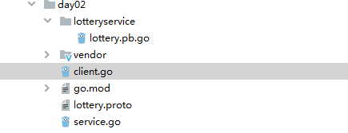
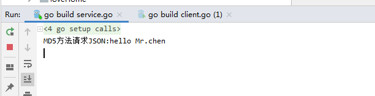
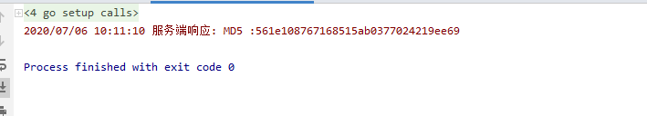

# 概述

php实践gRPC，服务端采用的golang，客户端采用PHP。这里主要讲述PHP客户端。

分为以下几个部分：

安装protoc
生成protobuf
安装PHP扩展
定义客户端
安装protoc
这里是windows环境

## gRPC的PHP客户端

#### a.安装grpc扩展

官网下载dll 文件

```
https://pecl.php.net/package/grpc ，这里使用https://pecl.php.net/package/gRPC/1.30.0/windows ，具体请看grpc版本:https://github.com/grpc/grpc/tree/master/src/php
```

修改php.ini文件，添加

```
extension=php_grpc.dll
```

查看phpinfo 是否有grpc扩展

安装protobuf扩展，可装，本人暂时没进行下面的安装
protobuf扩展:<https://pecl.php.net/package/protobuf> 

#### b、下载protoc命令，这里使用3.12.2版本

 安装Protobuf 编译器 protoc，下载地址：  https://github.com/google/protobuf/releases
 我的是windows，将压缩包bin目录下的exe放到环境PATH目录中即可，注意安装的protoc版本与grpc对应。

验证

```
protoc --version
```

grpc与protoc版本对应如下图


### 2、生成protobuf文件

使用服务端的.proto文件，执行protoc --php_out=. lottery.proto

```
syntax = "proto3";
package lotteryservice;
service Greeter {
    rpc lottery(lotteryReq) returns (lotteryRes){}
}

message lotteryReq {
    string param = 1;
}

message lotteryRes {
    string data = 1;
}
```

会生成如下目录：


### 3、自定义客户端

在项目目录下编写composer.json

```
{
  "name": "grpc-go-php",
  "require": {
    "grpc/grpc": "^v1.3.0",
    "google/protobuf": "^v3.3.0"
  },
  "autoload":{
    "psr-4":{
      "GPBMetadata\\":"GPBMetadata/",
      "Lotteryservice\\":"Lotteryservice/"
    }
  }
}
```


composer install 之后会生成vendor目录：

```
#本人采用的下面的composer，其它安装的composer请使用composer install
D:\phpStudy\PHPTutorial\php\php-7.2.1-nts\php D:\phpStudy\PHPTutorial\php\php-5.6.27-nts\composer.phar install
```

在Lotteryservice文件夹中，创建GreeterClient.php

```
<?php
/**
 * 当前文件是自己编写的，使用服务端的.proto文件，执行protoc --php_out=. lottery.proto这样是不会生成当前的文件，当使用
 * $ protoc --proto_path=./ --php_out=./ --grpc_out=./ --plugin=protoc-gen-grpc=/usr/local/bin/grpc_php_plugin ./lottery.proto
 *是会自动生成如下文件
 *
 */
namespace Lotteryservice
class GreeterClient extends \Grpc\BaseStub {

    /**
     * @param string $hostname hostname
     * @param array $opts channel options
     * @param \Grpc\Channel $channel (optional) re-use channel object
     */
    public function __construct($hostname, $opts, $channel = null) {
        parent::__construct($hostname, $opts, $channel);
    }

    /**
     * Sends a greeting
     * @param \Lotteryservice\lotteryReq $argument input argument
     * @param array $metadata metadata
     * @param array $options call options
     */
    public function lottery(\Lotteryservice\lotteryReq $argument,
      $metadata = [], $options = []) {
        return $this->_simpleRequest('/lotteryservice.Greeter/lottery',
        $argument,
        ['\Lotteryservice\lotteryRes', 'decode'],
        $metadata, $options); // lotteryservice为lottery.proto文件下的package名称，Greeter为ottery.proto文件下的service的名称，lottery为rpc的方法名
    }

}
```


在项目目录下创建index.php，用于测试连接：

```
<?php
use Grpc\ChannelCredentials;
ini_set("display_errors", true);
error_reporting(E_ALL);

$lotteryRequest = new \Lotteryservice\lotteryReq();
$lotteryRequest->setParam("hello");
$client = new \Lotteryservice\GreeterClient("127.0.0.1:8028", [
    'credentials' => ChannelCredentials::createInsecure(), //不加密
    'timeout' => 3000000,
]);
//分别是响应、状态对象
list($reply, $status) = $client->Lottery($lotteryRequest)->wait();

if (!$reply) {
    echo json_encode($status);
    return;
}
//data
$data = $reply->getData();
var_dump($data);die;

```

最后执行D:\phpStudy\PHPTutorial\php\php-7.2.1-nts\php  F:\testgrpc\index.php


## gRPC的golang服务端

### 准备工作

1、先安装Protobuf 编译器 protoc，下载地址：  https://github.com/google/protobuf/releases
 我的是windows，将压缩包bin目录下的exe放到环境PATH目录中即可。

```
linux环境下安装protobuf
下载protobuf 官网,下载地址：https://github.com/protocolbuffers/protobuf/releases
解压下载的文件 tar zxvf 文件名
cd到protobuf-x.x.x目录
$./configure
$make
$make check
$sudo make install （需要接着输入密码）
$which protoc
$protoc --version
```

|        |           |         |          |         |          |
| ------ | --------- | ------- | -------- | ------- | -------- |
| grpc   | protobuf  | grpc    | protobuf | grpc    | protobuf |
| v1.0.0 | 3.0.0(GA) | v1.12.0 | 3.5.2    | v1.22.0 | 3.8.0    |
| v1.0.1 | 3.0.2     | v1.13.1 | 3.5.2    | v1.23.1 | 3.8.0    |
| v1.1.0 | 3.1.0     | v1.14.2 | 3.5.2    | v1.24.0 | 3.8.0    |
| v1.2.0 | 3.2.0     | v1.15.1 | 3.6.1    | v1.25.0 | 3.8.0    |
| v1.2.0 | 3.2.0     | v1.16.1 | 3.6.1    | v1.26.0 | 3.8.0    |
| v1.3.4 | 3.3.0     | v1.17.2 | 3.6.1    | v1.27.3 | 3.11.2   |
| v1.3.5 | 3.2.0     | v1.18.0 | 3.6.1    | v1.28.1 | 3.11.2   |
| v1.4.0 | 3.3.0     | v1.19.1 | 3.6.1    | v1.29.0 | 3.11.2   |
| v1.6.0 | 3.4.0     | v1.20.1 | 3.7.0    | v1.30.0 | 3.12.2   |
| v1.8.0 | 3.5.0     | v1.21.3 | 3.7.0    |         |          |

创建文件目录grpc/day02,创建mod依赖文件

```
go mod init
```

然后获取插件支持库

```
  // gRPC运行时接口编解码支持库
  go get -u github.com/golang/protobuf/proto
  // 从 Proto文件(gRPC接口描述文件) 生成 go文件 的编译器插件
  go get -u github.com/golang/protobuf/protoc-gen-go
```

获取go的gRPC包(网络问题可参阅<http://cblog.1024.company/2-42.html> )

```
  go get google.golang.org/grpc
```

项目文件结构：



当前目录运行：

```
// 检查依赖文件
go mod tidy
// 同步文件到当前项目
go mod vendor
```

### 接口文件 /protobuf/

新建 lottery.proto示例：

```
 syntax = "proto3";
package lotteryservice;
service Greeter {
    rpc lottery(lotteryReq) returns (lotteryRes){}
}

message lotteryReq {
    string param = 1;
}

message lotteryRes {
    string data = 1;
}
```

proto文件语法详解参阅：  https://blog.csdn.net/u014308482/article/details/52958148

然后将proto文件编译为go文件

```
  // protoc --go_out=plugins=grpc:{输出目录}  {proto文件}  ,生成服务端的文件需要加go_out=plugins
  protoc --go_out=plugins=grpc:../ ./lotteryservice/ lottery.proto
```

注意：原则上不要修改编译出来的`*.bp.go`文件的代码，因为双方接口基于同一个proto文件编译成自己的语言源码，此文件只作为接口数据处理，业务具体实现不在`*.bp.go`中。

### 服务端 server.go

基于  https://blog.csdn.net/u014308482/article/details/52958148的Demo在修改中理解gRPC
 其中中文注释均为个人理解笔记，若有不严谨的地方，还望指正。

```
/**
* @program: Go
*
* @description:
*
* @author: Mr.chen
*
* @create: 2020-07-07 11:19
**/

package main
import (
	"crypto/md5"
	"fmt"
	"golang.org/x/net/context"
	"google.golang.org/grpc"
	"google.golang.org/grpc/reflection"
	"grpc/day02/lotteryservice"
	"log"
	"net"
)

// 业务实现方法的容器
type server struct{}

// 为server定义 DoMD5 方法 内部处理请求并返回结果
// 参数 (context.Context[固定], *test.Req[相应接口定义的请求参数])
// 返回 (*test.Res[相应接口定义的返回参数，必须用指针], error)
func (s *server) Lottery(ctx context.Context, in *lotteryservice.LotteryReq) (*lotteryservice.LotteryRes, error) {
	fmt.Println("MD5方法请求JSON:"+in.Param)
	return &lotteryservice.LotteryRes{Data: "MD5 :" + fmt.Sprintf("%x", md5.Sum([]byte(in.Param)))}, nil
}


func main() {
	lis, err := net.Listen("tcp", "127.0.0.1:8028")  //监听所有网卡8028端口的TCP连接
	if err != nil {
		log.Fatalf("监听失败: %v", err)
	}
	s := grpc.NewServer() //创建gRPC服务

	/**注册接口服务
	 * 以定义proto时的service为单位注册，服务中可以有多个方法
	 * (proto编译时会为每个service生成Register***Server方法)
	 * 包.注册服务方法(gRpc服务实例，包含接口方法的结构体[指针])
	 */

	lotteryservice.RegisterGreeterServer(s, &server{})
	/**如果有可以注册多个接口服务,结构体要实现对应的接口方法
	 * user.RegisterLoginServer(s, &server{})
	 * minMovie.RegisterFbiServer(s, &server{})
	 */
	// 在gRPC服务器上注册反射服务
	reflection.Register(s)
	// 将监听交给gRPC服务处理
	err = s.Serve(lis)
	if  err != nil {
		log.Fatalf("failed to serve: %v", err)
	}
}


```

### 客户端client.go

```
/**
* @program: Go
*
* @description:grpc客户端调用一
*
* @author: Mr.chen
*
* @create: 2020-07-06 10:04
**/
package main
import (
	"golang.org/x/net/context"
	"google.golang.org/grpc"
	"grpc/day02/lotteryservice"
	"log"
	"os"
)


func main() {
	// 建立连接到gRPC服务
	conn, err := grpc.Dial("127.0.0.1:8028", grpc.WithInsecure())
	if err != nil {
		log.Fatalf("did not connect: %v", err)
	}
	// 函数结束时关闭连接
	defer conn.Close()
	// 创建Waiter服务的客户端
	t := lotteryservice.NewGreeterClient(conn)
	// 模拟请求数据
	res := "hello Mr.chen"
	// os.Args[1] 为用户执行输入的参数 如：go run ***.go 123
	if len(os.Args) > 1 {
		res = os.Args[1]
	}

	// 调用gRPC接口
	tr, err := t.Lottery(context.Background(), &lotteryservice.LotteryReq{Param:res})
	if err != nil {
		log.Fatalf("could not greet: %v", err)
	}
	log.Printf("服务端响应: %s", tr.Data)
}

```

启动服务端监听，运行客户端即可达成远程调用

  服务端运行结果



 客户端运行结果




## 参考文档列表

PHP github文档<https://github.com/grpc/grpc/tree/master/src/php> 

PHP grpc官方文档 https://grpc.io/docs/quickstart/php.html

PHP grpc官方案例 https://grpc.io/docs/tutorials/basic/php.html
PHP grpc官方案例之github下载 https://github.com/grpc/grpc/tree/master/examples/php

PHP GRPC 模块安装配置 :<https://www.jianshu.com/p/1d550bb8509d> 

php+grpc+protobuf整合（php客户端+go服务端）https://blog.csdn.net/myeye520/article/details/103923752

gRPC入坑记  https://www.cnblogs.com/52fhy/p/11110704.html